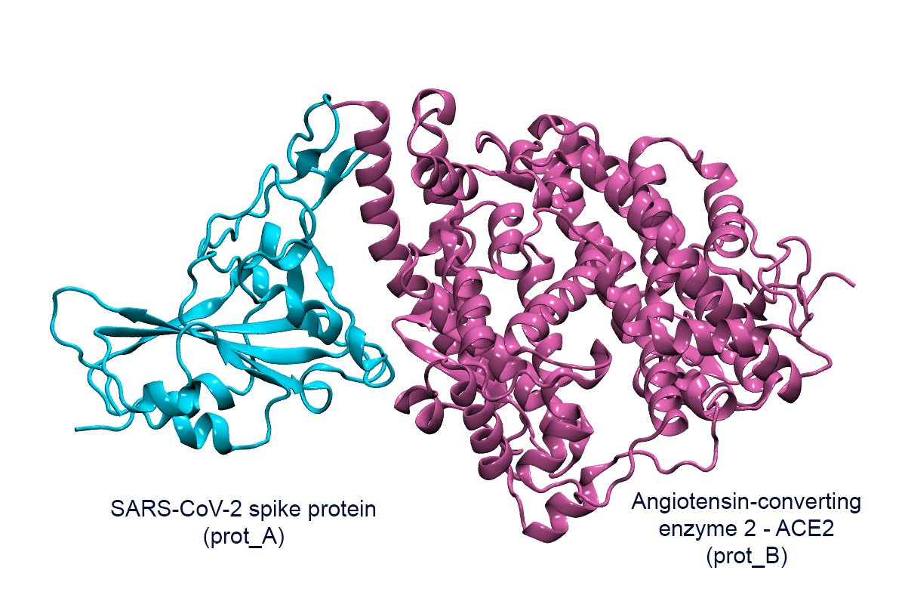
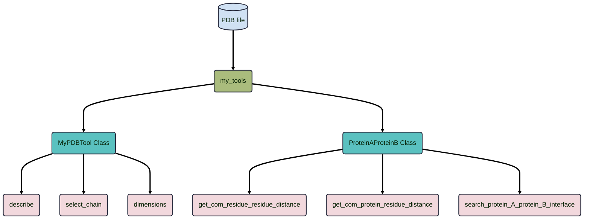
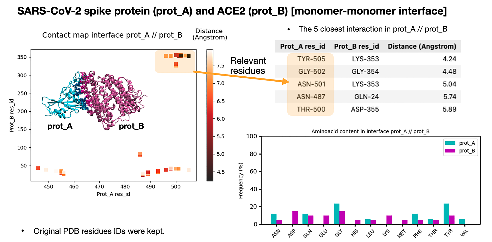

## Overview

In this project I implemented python modules to analyse the interface of SARS-CoV-2 spike protein (prot_A) which plays a key role in the receptor recognition to the host receptor angiotensin-converting enzyme 2 (ACE2, prot_B). This preliminary study looks for the binding of prot_A with different proteins to diminish binding with Antibody P5A3C8 (prot_H and prot_L) and maintain or increase binding with ACE2 (prot_B). Studying their interfaces will provide insights that could inform future interface redesign efforts for prot_A.

Usage is in the Jupyter notebok : example.ipynb





## 1. Setup

Python libraries used:

- MDAnalysis

The set up can be easily done with conda enviroments using the YAML file.

```
conda env create -f analysis_env.yaml
```

## 2. Python modules overview and approach


 ### Algorithm and approach


### python module




## 3. Outputs

PDB outputs



## 4. Usage