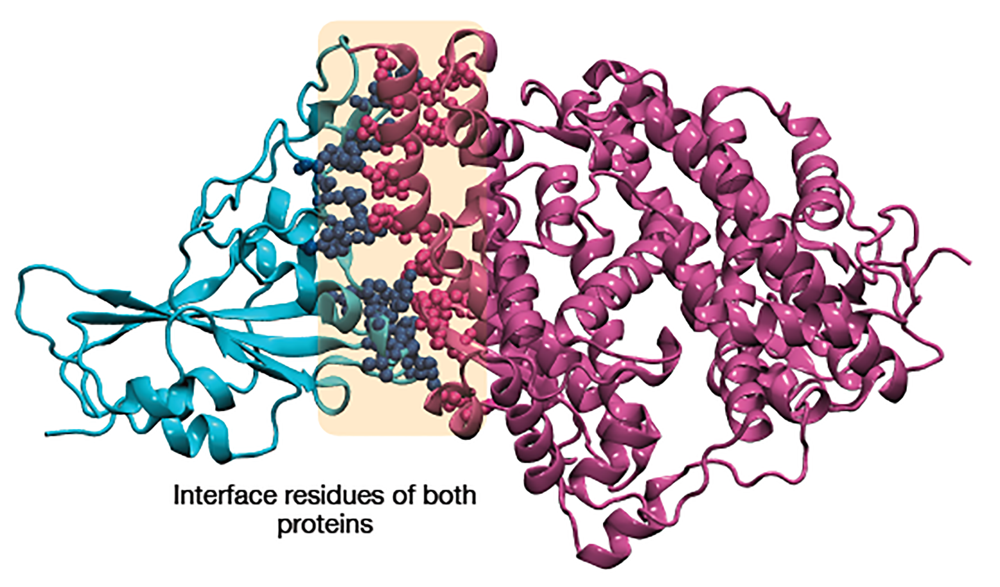

## Overview


## 1. Setup

Python libraries used:

- MDAnalysis

The set up can be easily done with conda enviroments using the YAML file.

```
conda env create -f analysis_env.yaml
```

## 2. Python modules overview


## 3. Outputs

PDB outputs



## 4. Usage